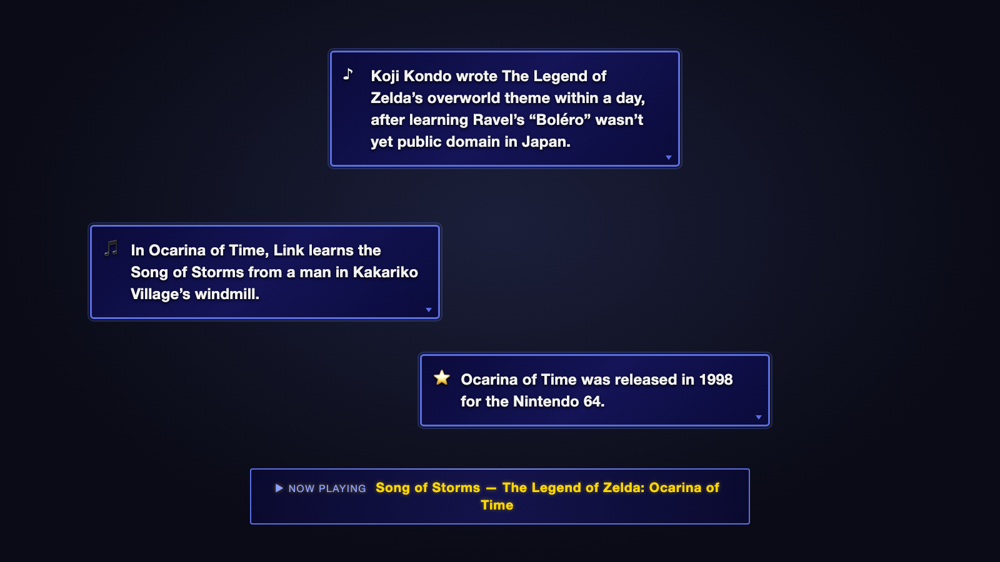

# BubbleFacts

**Fun facts about the song you're playing, right on your stream.**

BubbleFacts watches your [StreamerSongList](https://streamersonglist.com) or
[StreamElements](https://streamelements.com) song requests and shows short,
Wikipedia-checked facts in game-inspired bubbles in OBS while you play. The captions are written by a small AI model, and the app
itself was written with an AI coding agent: see
[AI disclosure](#ai-disclosure).

## Download

**[Download BubbleFacts](https://bubblefacts.frolic.org/download.html)** from
the website. It's free, for Mac, Windows and Linux.

This is a beta. The app isn't code-signed yet, so the first time you open it,
your computer may ask you to confirm that you want to run it. The download
page shows what to click.

## Get running in two steps

1. **Connect your songs.** Click **Sign in with StreamerSongList** and sign in
   with Twitch. (If that doesn't work, **Having trouble signing in?** lets you
   paste a token instead.) Take requests through StreamElements instead?
   Choose **StreamElements** and paste your JWT token from the StreamElements
   dashboard.
2. **Add BubbleFacts to OBS.** Drag the tile from the app into the **Sources**
   list in OBS.

A test bubble appears in OBS, and the app says **It's on your stream!** That's
it. An optional last step, **Tell us about your music**, lets you mark your
originals and live learns and add messages of your own.

No coding. No Terminal. No AI setup.

The built-in fact writer gets ready in the background, so you don't have to
wait for it during setup. The
[setup guide](https://bubblefacts.frolic.org/guide.html) walks through every
screen.

## How BubbleFacts checks its facts

AI can make things up. BubbleFacts is built to keep made-up facts off your
stream, so its fact writer never answers from memory.

1. When a song starts, it finds the Wikipedia article for the song, or for the
   game or film it's from.
2. The fact writer writes short captions **only from that article**.
3. Any caption that names a person, year or console the article doesn't
   contain is dropped before it reaches your stream.
4. If there's no good Wikipedia match, no AI is used. BubbleFacts looks the
   song up on Wikidata, then MusicBrainz, and fills in fixed sentences from
   what they list, such as the year and the album. If they have nothing
   either, it shows backup facts you write yourself, or nothing.

Facts are only as good as Wikipedia: the check makes sure captions match the
article, not that the article is right. Found a wrong fact? Click **Wrong** next to it in the app. It comes off your
stream right away, and BubbleFacts won't use that Wikipedia article for that
song again. **Tell us about it** then opens a
[report](https://github.com/frolicchris/bubblefacts/issues/new?template=wrong_fact.yml),
the most useful report of all.

## AI disclosure

BubbleFacts is developed with AI assistance. Most of the code so far was
generated by [Claude Code](https://claude.com/claude-code), Anthropic's AI
coding agent. The maintainer, Christopher Feyrer
([@frolicchris](https://github.com/frolicchris)), is the human in the loop:
he reviews and tests every change, including on live streams, and is
responsible for everything that's merged or released.

The captions on stream are written by a small AI model (Meta's Llama 3.2)
from the song's Wikipedia article, then checked against it. Facts from
Wikidata and MusicBrainz are fixed sentences filled in from their data, with
no AI involved.

Contributions are welcome, with or without AI tools. If you use one, say so in
your pull request and add an `Assisted-by:` trailer to your commits. Details
are in [AI_DISCLOSURE.md](AI_DISCLOSURE.md).

## Help

- [Setup guide](https://bubblefacts.frolic.org/guide.html), step by step with pictures
- [Discord](https://discord.gg/gXdVKc6KWx) for quick questions, or
  [Discussions](https://github.com/frolicchris/bubblefacts/discussions/categories/q-a)
- [Report a problem](https://github.com/frolicchris/bubblefacts/issues/new?template=bug_report.yml).
  In the app, **Report a problem** fills in the details for you.
- [Report a wrong fact](https://github.com/frolicchris/bubblefacts/issues/new?template=wrong_fact.yml).
  In the app, click **Wrong** next to it, then **Tell us about it**.
- [Beta test report](https://github.com/frolicchris/bubblefacts/issues/new?template=beta_test.yml):
  tried the beta? Tell us how each step went.
- [Security policy](SECURITY.md): report security problems privately.

## For developers

- **[Manual setup (command line)](docs/MANUAL-SETUP.md):** run the overlay
  with Node.js and a settings file, without the app. Its backup facts are a
  few examples you replace with your own.
- **[Build and run the app from source](CONTRIBUTING.md#working-on-the-desktop-app)**,
  and how to contribute.
- [How it works](docs/ARCHITECTURE.md), and why. Read it before changing how
  facts are found or checked.
- [Every setting](docs/CONFIG.md) for the command-line version.
- [Desktop app design](docs/DESKTOP-APP.md)

## Credits and license

Facts are rewritten from Wikipedia, whose text is shared under
[CC BY-SA 4.0](https://creativecommons.org/licenses/by-sa/4.0/). If you publish
recordings, crediting Wikipedia in your description is the courteous thing to
do. Facts from [Wikidata](https://www.wikidata.org) and
[MusicBrainz](https://musicbrainz.org) use their public domain
([CC0](https://creativecommons.org/publicdomain/zero/1.0/)) data.

Built with Llama. The app's built-in AI is Meta's Llama 3.2 3B, used under the
[Llama 3.2 Community License](https://www.llama.com/llama3_2/license/).

The code is [MIT licensed](LICENSE). The BubbleFacts name and logo are
trademarks of Christopher Feyrer and aren't covered by the MIT license: forks
are welcome, under a different name.
